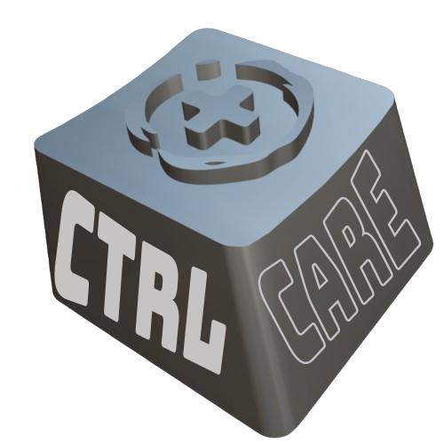

<br />  
<div align="center">  
  
</a>  
  
<h3 align="center">Ctrl+Care</h3>  
<p><i>Take control and care of your medical files.</i></p>
<p align="center">  
 
<br />  
<br />  
<a href="[]()">View Demo</a>  
</p>  
</div>  

## About The Project  
Ctrl+Care is a web application that allows users to manage electronic medical records (EMR) for patients. It supports adding, viewing, updating, and deleting patient data.

<p align="right">(<a href="#readme-top">back to top</a>)</p>  
  
  
## How to Run Locally 
1. Clone the repository: 
```sh  
git clone <repository-url>
```  
2. Install dependencies:
```sh  
npm install
```  
3. Start the application:
```sh  
npm start
```
4. Visit `http://localhost:3000` in your browser.


<p align="right">(<a href="#readme-top">back to top</a>)</p>  
  

### Built With
[![Node][Node.js]][Node-url]
[![Express][Express.js]][Express-url]


<p align="right">(<a href="#readme-top">back to top</a>)</p>

### Author:

<a href="https://github.com/justcallmezaaii/web-app/graphs/contributors">
  
</a>

  
<!-- CONTACT -->  
## Contact  
  
Zairen V. Lapid - zvl0248@students.uc-bcf.edu.ph  

Project Link: [[https://github.com/justcallmezaaii/web-app](https://github.com/justcallmezaaii/web-app)]
  
<p align="right">(<a href="#readme-top">back to top</a>)</p>


[contributors-url]: https://github.com/justcallmezaaii/web-app/graphs/contributors|
[Node.js]: https://upload.wikimedia.org/wikipedia/commons/7/7e/Node.js_logo_2015.svg
[Node-url]: https://nodejs.org/en
[Express.js]: https://seeklogo.com/images/E/express-logo-E9DA5D0AF7-seeklogo.com.png
[Express-url]: https://expressjs.com/


